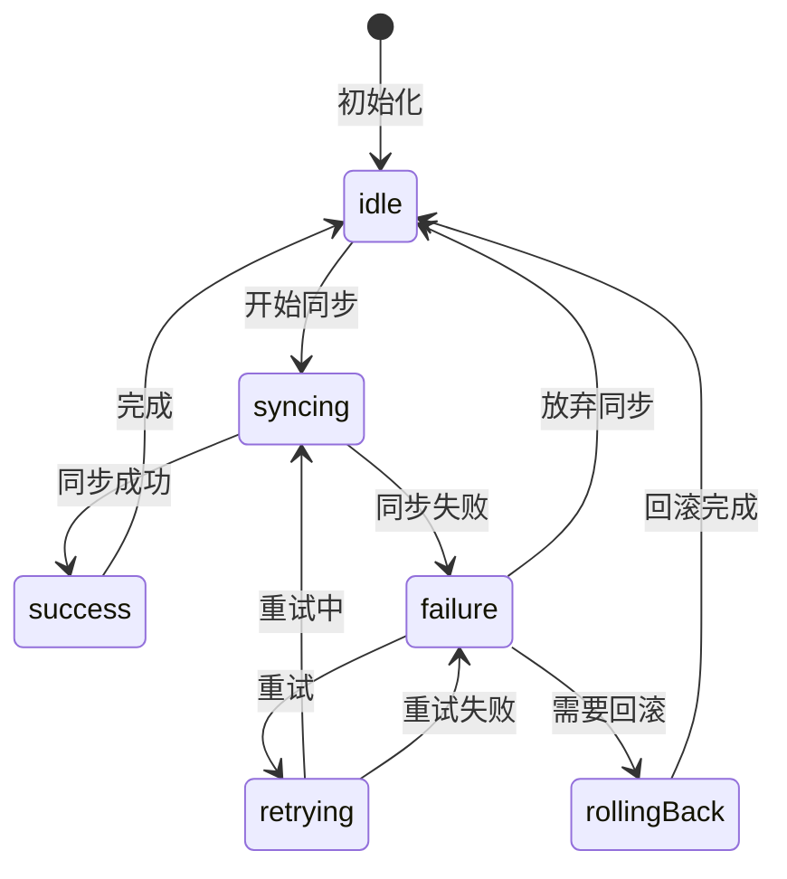

# 数据同步

**核心原则：双模同步 (Dual Mode) · 冲突解决 (Conflict Resolution) · 分布式锁 (Distributed Lock)**

## SyncService 设计

**职责**:
- 调度所有同步任务
- 管理分布式锁（防止多实例并发）
- 实现双模同步（增量 + 全量）

**实现位置**: `lib/core/sync/sync_service.dart`

**实现模式**:
```dart
@riverpod
class SyncService extends _$SyncService {
  Future<void> scheduleSync() async { /* 调度同步任务 */ }
  Future<void> syncNow() async { /* 立即执行同步 */ }
  Future<void> enqueueRetry(String id) async { /* 加入重试队列 */ }
}
```

## 同步模式

- **增量同步**: 基于 `fetchCursor` 时间游标，只拉取变更
- **全量同步**: 周期性或异常时执行完整三路合并

## 同步状态机

**规则**: 使用状态机管理同步状态，避免仅依赖布尔值或枚举导致的状态转换错误。

**必要性**: 复杂的同步逻辑（上传中、失败、回滚、冲突）需要明确的状态转换规则，状态机可以：
- 检查状态转换的合法性
- 避免无效状态组合
- 提供清晰的状态转换逻辑

**推荐工具**: 使用轻量级状态机库（如 `statemachine` 包）

**状态转换图**:



**状态定义**:

- **idle**: 空闲状态，等待同步任务
- **syncing**: 同步进行中
- **success**: 同步成功
- **failure**: 同步失败
- **retrying**: 重试中
- **rollingBack**: 回滚中

**实现模式**:

状态机应实现状态转换合法性检查，确保状态转换符合状态转换图的规则：

```dart
enum SyncState {
  idle,
  syncing,
  success,
  failure,
  retrying,
  rollingBack,
}

// 状态转换检查：确保状态转换符合状态转换图
bool isValidTransition(SyncState from, SyncState to) {
  switch (from) {
    case SyncState.idle:
      return to == SyncState.syncing;
    case SyncState.syncing:
      return to == SyncState.success || to == SyncState.failure;
    case SyncState.failure:
      return to == SyncState.retrying || 
             to == SyncState.rollingBack || 
             to == SyncState.idle;
    // ... 其他状态转换规则参考状态转换图
  }
}
```

## 软删除机制 (Soft Delete / Tombstones)

**规则**: 离线优先架构中，**严禁物理删除（Hard Delete）**，必须使用软删除。

**实现**:
- 所有 Entity 必须包含 `deletedAt` 字段（DateTime?）
- 删除操作：设置 `deletedAt = DateTime.now()`，不删除记录
- 查询时自动过滤 `deletedAt != null` 的记录

**墓碑传播**:
- 同步时，`deletedAt != null` 的记录作为"墓碑"传播到服务器
- 服务器收到墓碑后，标记远程记录为已删除
- 其他客户端同步时，收到墓碑后本地也标记为删除

**实现位置**: `lib/core/sync/tombstone_handler.dart`

## 冲突解决策略

**简单字段**: Last-Write-Wins (LWW)
- 谁最后修改，采纳谁的值

**复杂字段**: 三路合并 (Three-Way Merge)
- 使用 `ShadowMap` 追踪上次同步状态（Base）
- 对比 Local、Remote、Base 三个版本
- 字段级智能合并：Local 和 Remote 都修改的字段，优先 Remote

**冲突降级**: 无法自动解决时，使用 LWW 策略

**实现位置**: `lib/core/sync/merge_strategy.dart`

## 分布式锁

**规则**: 防止多实例并发同步导致数据冲突。

**实现**:
- 使用 Isar 的原子操作实现锁
- 设置超时时间，防止死锁

详见: [乐观更新](./乐观更新.md) | [离线优先](./离线优先.md)


