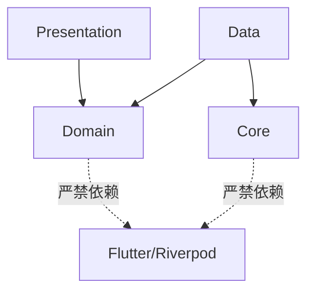

# 架构分层原则

**核心原则：分层 (Layered) · 隔离 (Isolated) · 可测试 (Testable)**

> **架构守护**: 依赖规则由自定义 `analyzer` 插件强制执行。运行 `dart analyze` 检查依赖违规。

## 分层架构

项目采用严格的分层架构（Clean Architecture），每层有明确的职责边界：

## 依赖方向规则

- **单向依赖**: 上层可以依赖下层，下层严禁依赖上层
- **领域层隔离**: `lib/features/*/domain/` 严禁导入 Flutter Widget、Riverpod 或任何 UI 框架
- **数据层独立**: `lib/features/*/data/` 可以依赖 `domain/` 和 `core/`，但不能依赖 `presentation/`

## 各层职责

### 表示层 (Presentation)
- **位置**: `lib/features/*/presentation/`
- **职责**: UI 渲染、用户交互、状态管理、路由导航
- **禁止**: 直接访问数据库或网络，包含业务逻辑

### 领域层 (Domain)
- **位置**: `lib/features/*/domain/`
- **职责**: 业务实体定义（Freezed）、Repository 接口、业务逻辑（纯 Dart）
- **禁止**: 导入 Flutter、Riverpod、数据库或网络库

### 数据层 (Data)
- **位置**: `lib/features/*/data/`
- **职责**: Repository 实现、数据源（Isar/Supabase/API）、数据转换
- **禁止**: 直接暴露数据源给 Presentation 层，包含业务逻辑

### 核心层 (Core)
- **位置**: `lib/core/`
- **职责**: 跨功能基础设施（主题、路由、异常、同步服务）、工具函数、共享常量
- **禁止**: 包含业务逻辑，依赖特定 Feature 模块

## 架构守护

依赖规则已由自定义 `analyzer` 插件强制执行。如果有人在 `domain/` 中导入 `flutter/material.dart` 或 `riverpod`，构建将直接失败。

详见: [技术选型](./技术选型.md) | [代码组织](./代码组织.md)

